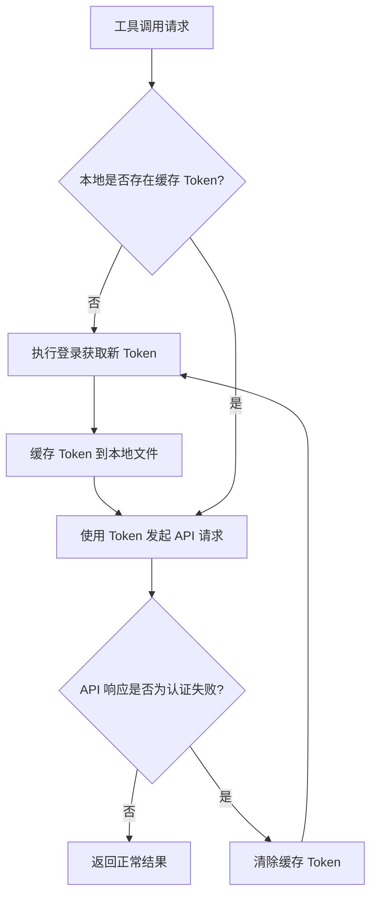

# DBDoctor Skills 迁移设计：Bash 到 Python

## 1. 目标

将 SKILL.md 中定义的 24 个 Bash curl 工具全部迁移为 Python 脚本调用方式，通过环境变量（`dbdoctor_url`、`user`、`password`）进行配置，并实现统一的登录认证与 Token 缓存机制。

---

## 2. 环境变量配置

使用以下 3 个环境变量替代原有 `.env` 文件中的多项配置：

| 环境变量 | 描述 | 示例 |
|---|---|---|
| dbdoctor_url | DBDoctor 平台地址（含协议和端口） | `http://10.18.210.10:13000` |
| dbdoctor_user | 登录用户名 | `tester` |
| dbdoctor_password | 登录密码（明文，程序内 RSA 加密后传输） | `mypassword` |

---

## 3. 项目目录结构

```
dbdoctor-tools/
├── requirements.txt          # Python 依赖
├── common/
│   ├── __init__.py
│   ├── config.py             # 环境变量读取
│   ├── auth.py               # 登录认证与 Token 管理
│   └── client.py             # HTTP 请求封装（自动携带 Token）
├── tools/
│   ├── __init__.py
│   ├── get_instance.py
│   ├── get_instance_abnormal.py
│   ├── get_database_by_instance.py
│   ├── manage_instance.py
│   ├── get_slow_sql.py
│   ├── get_table_ddl.py
│   ├── execute_sql.py
│   ├── sql_audit.py
│   ├── get_sql_audit_rules.py
│   ├── do_inspect_instance.py
│   ├── get_recent_inspect_report.py
│   ├── get_inspect_item.py
│   ├── get_current_process.py
│   ├── alert_message.py
│   ├── get_basic_monitor_info.py
│   ├── get_host_resource_info.py
│   ├── get_db_parameter_info.py
│   ├── get_aas_info.py
│   ├── get_related_sql_info.py
│   ├── get_instance_info.py
│   ├── get_slow_sql_by_time.py
│   ├── ai_sql_rewrite.py
│   └── get_sql_rewrite_result.py
├── SKILL.md                  # 原有技能定义（保留）
└── .env                      # 原有配置（保留兼容）
```

---

## 4. 公共模块设计

### 4.1 config.py - 环境变量管理

职责：从操作系统环境变量中读取 `dbdoctor_url`、`dbdoctor_user`、`dbdoctor_password`，缺失时抛出明确的异常提示。

对外提供一个统一的配置对象，包含以下属性：

| 属性 | 来源 | 说明 |
|---|---|---|
| base_url | 环境变量 `dbdoctor_url` | API 基础地址 |
| username | 环境变量 `dbdoctor_user` | 登录用户名 |
| password | 环境变量 `dbdoctor_password` | 登录密码（明文） |

### 4.2 auth.py - 认证与 Token 管理

职责：处理登录、密码 RSA 加密、Token 缓存与自动刷新。

#### 4.2.1 密码加密

使用 RSA 公钥对明文密码进行加密，公钥硬编码在模块中（与前端 JSEncrypt 使用同一公钥）：

- 算法：RSA PKCS1 v1.5
- 公钥格式：PEM（2048 位）
- 公钥内容（固定值）：

```
-----BEGIN PUBLIC KEY-----
MIIBIjANBgkqhkiG9w0BAQEFAAOCAQ8AMIIBCgKCAQEAuvJKNhSl6pmfNYqLLADJ
1M59E3TW4ldYcq0PGpMlDLiNbjHW1Jt14zuNPxc+x2HFUPTHgngSHhURD0ZXJjYC
kLmkOKVxv/9nZS3Thp5oJNXjk6wZEqneaaNdYT4KgSVc7DhO3oXXUFyrNzNNffs5
paQ1Zd2JZhDYZxgpMlh2FMixkIz8znX8HDvLP8Fg5ImzoA50ljoV6w52EBRdo9+YO
3zsflMFdLJnj10SDJyFcmI6rhXoE/C3eFMVyNdoPYQFVgHkyl6HTE92OVzSB41u/F
9kQaawBll5KsgUs6XwmSK9NWVBz6i5M/vgP9A2Yz6aS+ZeenDm2gjjOiwETSqRsQ
IDAQAB
-----END PUBLIC KEY-----
```

- 输入：明文密码字符串
- 输出：Base64 编码的加密字符串

#### 4.2.2 登录流程

调用登录接口获取 authToken：

- 请求方式：POST
- 请求路径：`{base_url}/nephele/login`
- 请求头：

| Header | 值 |
|---|---|
| Content-Type | application/json |
| Accept | application/json, text/plain, */* |
| appKey | commonweb |
| app-language | zh-cn |
| cluster | idc |

- 请求体：`{"userName": "{username}", "password": "{RSA加密后的密码}"}`
- 成功响应提取：`response["data"]["authToken"]`
- SSL 验证：禁用（对应 curl 的 `--insecure` 参数）

#### 4.2.3 Token 缓存策略



缓存机制说明：

| 项目 | 说明 |
|---|---|
| 存储位置 | 项目目录下的 `.token_cache` 文件 |
| 存储内容 | authToken 字符串 |
| 读取策略 | 每次调用优先读取缓存文件中的 Token |
| 失效判断 | 当 API 返回认证失败（HTTP 401 或响应中 success=false 且为 Token 相关错误）时判定为失效 |
| 刷新策略 | 失效后自动重新登录获取新 Token，更新缓存文件，然后重试原请求（仅重试一次，避免死循环） |

### 4.3 client.py - HTTP 请求封装

职责：封装 HTTP GET/POST 请求，自动注入认证 Token，处理 Token 失效重试逻辑。

对外提供两个核心方法：

| 方法 | 说明 |
|---|---|
| get(path, params) | 发送 GET 请求，path 为相对路径（如 `/drapi/ai/instanceMessage`），params 为查询参数字典 |
| post(path, params, json_body) | 发送 POST 请求，params 为 URL 查询参数，json_body 为请求体 |

每个请求自动携带的公共 Header：

| Header | 值 |
|---|---|
| Content-Type | application/json |
| auth_token | 从 auth 模块获取的当前有效 Token |

请求行为：
- 所有请求禁用 SSL 证书验证
- 请求失败时（Token 失效），自动触发 auth 模块的刷新逻辑并重试一次
- 返回解析后的 JSON 响应字典

---

## 5. 工具模块设计

每个工具对应一个独立的 Python 文件，位于 `tools/` 目录下。每个文件：
- 导入 `common.client` 模块发起请求
- 定义一个与文件同名的主函数，接收该工具所需的业务参数
- 函数内部组装请求路径和参数，调用 client 的 get/post 方法
- 返回 API 的 JSON 响应

### 5.1 工具清单与接口映射

#### 实例管理类

| 工具文件 | 函数名 | HTTP 方法 | API 路径 | 业务参数 |
|---|---|---|---|---|
| get_instance.py | get_instance | GET | /drapi/ai/instanceMessage | tenant_name, project_name |
| get_instance_abnormal.py | get_instance_abnormal | GET | /drapi/ai/instranceMessageAbnormal | instance_id |
| get_database_by_instance.py | get_database_by_instance | GET | /draArmor/sqlConsole/queryDbObject | instance_id |
| manage_instance.py | manage_instance | POST | /drapi/instanceCreate | ip, port, engine, db_user, encrypted_password, db_version, tenant, project, description(可选) |
| get_instance_info.py | get_instance_info | GET | /drapi/ai/instance/info | instance_id |

#### SQL 分析类

| 工具文件 | 函数名 | HTTP 方法 | API 路径 | 业务参数 |
|---|---|---|---|---|
| get_slow_sql.py | get_slow_sql | GET | /drapi/GetsSlowSqlDigest | instance_id, start_time, end_time |
| get_table_ddl.py | get_table_ddl | GET | /draArmor/sqlConsole/queryDdlText | instance_id, database, schema, table |
| execute_sql.py | execute_sql | POST | /draArmor/sqlConsole/dmsExecuteSql | instance_id, database, schema, sql, engine, tenant, project |
| sql_audit.py | sql_audit | POST | /drapi/sqlAudit/submit | instance_id, database, schema, sql |
| get_sql_audit_rules.py | get_sql_audit_rules | GET | /drapi/QueryStaticSqlAuditRulesDetails | engine(可选), rule_name(可选), priority(可选) |

#### 巡检类

| 工具文件 | 函数名 | HTTP 方法 | API 路径 | 业务参数 |
|---|---|---|---|---|
| do_inspect_instance.py | do_inspect_instance | GET | /inspect/QueryTemplatePolicysByInstance 然后 /inspect/ExecuteInspectTaskByInstance | instance_id |
| get_recent_inspect_report.py | get_recent_inspect_report | GET | /inspect/QueryInstanceReportListV2 | instance_id, start_time, end_time, tenant, project |
| get_inspect_item.py | get_inspect_item | GET | /inspect/QueryInspectItemList | 无 |

#### 会话与告警类

| 工具文件 | 函数名 | HTTP 方法 | API 路径 | 业务参数 |
|---|---|---|---|---|
| get_current_process.py | get_current_process | GET | /drapi/realTimeProcess/query | instance_id, database(可选), sql_keyword(可选) |
| alert_message.py | alert_message | GET | /drapi/alertV2/alertEventList | status(可选), priority(可选), event_name(可选), instance_ip(可选), instance_desc(可选), create_time(可选), modified_time(可选) |

#### 性能诊断类

| 工具文件 | 函数名 | HTTP 方法 | API 路径 | 业务参数 |
|---|---|---|---|---|
| get_basic_monitor_info.py | get_basic_monitor_info | GET | /drapi/ai/getResourceMetricsInNL | instance_id, start_time, end_time（MetricFrom=DB） |
| get_host_resource_info.py | get_host_resource_info | GET | /drapi/ai/getResourceMetricsInNL | instance_id, start_time, end_time（MetricFrom=HOST） |
| get_db_parameter_info.py | get_db_parameter_info | GET | /drapi/ai/getDBParamsInNL | instance_id |
| get_aas_info.py | get_aas_info | GET | /drapi/ai/activeSession/statistics | instance_id, start_time, end_time |
| get_related_sql_info.py | get_related_sql_info | GET | /drapi/ai/getAbnormalSqlByTime | instance_id, start_time, end_time |
| get_slow_sql_by_time.py | get_slow_sql_by_time | GET | /drapi/ai/getSlowSqlByTime | instance_id, start_time, end_time |

#### SQL 改写类

| 工具文件 | 函数名 | HTTP 方法 | API 路径 | 业务参数 |
|---|---|---|---|---|
| ai_sql_rewrite.py | ai_sql_rewrite | POST | /drapi/ai/rewriteAsync | instance_id, database, schema, sql |
| get_sql_rewrite_result.py | get_sql_rewrite_result | GET | /drapi/ai/sqlRewriteHistoryDetail | task_id |

### 5.2 特殊工具说明

#### do_inspect_instance（两步调用）

该工具需要先后调用两个接口：
1. 第一步：GET `/inspect/QueryTemplatePolicysByInstance` 传入 instance_id，获取巡检模板 ID
2. 第二步：GET `/inspect/ExecuteInspectTaskByInstance` 传入 instance_id 和第一步获取的 template_id，执行巡检

#### sql_audit（异步获取结果）

该工具提交审核后返回 task_id，需要额外调用 GET `/drapi/sqlAudit/sqlAuditResult` 传入 task_id 获取审核结果。函数内部应处理：提交 -> 获取 task_id -> 轮询/请求结果 -> 返回。

#### ai_sql_rewrite + get_sql_rewrite_result（异步任务对）

`ai_sql_rewrite` 提交改写任务返回 task_id，`get_sql_rewrite_result` 根据 task_id 查询结果。这两个保持为独立工具，由调用方自行组合。

---

## 6. 公共参数处理

原 SKILL.md 中部分接口需要 `UserId` 和 `Role` 参数。迁移后的处理方式：

| 原参数 | 迁移后来源 | 说明 |
|---|---|---|
| UserId | 环境变量 `user` 的值 | 登录用户名即为 UserId |
| Role | 硬编码为 `dev` | 保持与原 .env 一致，作为 client 模块的默认值 |
| AUTH_TOKEN | auth 模块自动管理 | 不再需要手动配置 |
| TENANT / PROJECT | 各工具函数的业务参数传入 | 由调用方按需提供 |

---

## 7. 依赖说明

requirements.txt 需要包含以下依赖：

| 依赖库 | 用途 |
|---|---|
| requests | HTTP 请求 |
| pycryptodome | RSA 加密（使用 `Crypto.PublicKey.RSA` 和 `Crypto.Cipher.PKCS1_v1_5` 实现与前端 JSEncrypt 兼容的 RSA PKCS1 v1.5 加密） |

---

## 8. 错误处理策略

| 错误场景 | 处理方式 |
|---|---|
| 环境变量缺失 | 在 config 模块初始化时抛出异常，明确提示缺少哪个环境变量 |
| 登录失败 | 抛出认证异常，包含登录接口返回的错误信息 |
| Token 失效 | 自动重新登录并重试一次，若仍失败则抛出异常 |
| API 请求网络错误 | 抛出连接异常，包含请求的 URL 和错误详情 |
| API 返回业务错误 | 原样返回 API 的 JSON 响应，由调用方判断 success 字段 |
