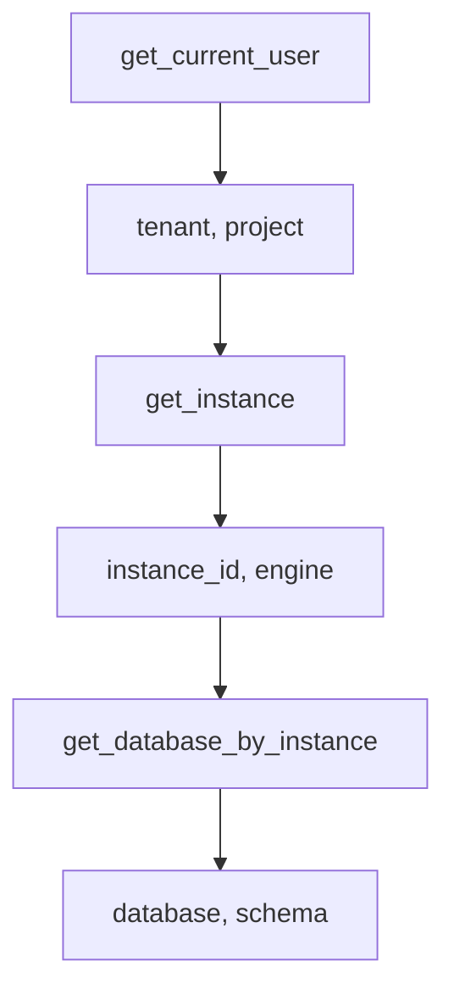

# 接口测试设计文档

## 1. 目标

为 `scripts/` 目录下的全部 22 个接口脚本编写集成测试，使用 pytest 框架，每个接口对应一个独立的测试文件。Token 直接从 `.token_cache` 文件中读取，不走登录流程。

## 2. 目录结构

在项目根目录下新建 `tests/` 目录，结构如下：

```
tests/
  conftest.py                         -- 共享 fixtures（token、动态测试参数）
  test_get_current_user.py
  test_get_instance.py
  test_get_instance_info.py
  test_get_instance_abnormal.py
  test_get_database_by_instance.py
  test_get_slow_sql.py
  test_get_slow_sql_by_time.py
  test_get_related_sql_info.py
  test_get_table_ddl.py
  test_sql_audit.py
  test_execute_sql.py
  test_get_aas_info.py
  test_get_basic_monitor_info.py
  test_get_current_process.py
  test_get_db_parameter_info.py
  test_get_host_resource_info.py
  test_get_inspect_item.py
  test_get_recent_inspect_report.py
  test_do_inspect_instance.py
  test_manage_instance.py
  test_performance_diagnosis.py
  test_ai_sql_rewrite.py
  test_alert_message.py
  test_get_sql_audit_rules.py
  test_get_sql_rewrite_result.py
```

## 3. 依赖管理

在 `requirements.txt` 中追加 pytest 依赖：`pytest`

## 4. conftest.py 共享 Fixtures 设计

conftest.py 负责提供测试所需的公共 fixtures，解决接口之间的数据依赖问题。

### 4.1 Token 获取方式

直接读取项目根目录下的 `.token_cache` 文件内容作为 token，不调用登录接口。如果文件不存在或为空则跳过测试（`pytest.skip`）。

### 4.2 Fixtures 依赖链

测试参数通过逐层调用接口动态获取，形成以下依赖链：



### 4.3 Fixtures 清单

| Fixture 名称 | 作用域 | 来源 | 提供的数据 |
|---|---|---|---|
| tenant_project | session | 调用 `get_current_user` 接口，解析 tenantMapping 取第一组 | tenant, project |
| instance_id | session | 调用 `get_instance` 接口（使用 tenant_project），取第一个实例的 ID | instance_id |
| instance_engine | session | 同上，从实例信息中提取 engine 字段 | engine（如 mysql） |
| database_info | session | 调用 `get_database_by_instance`（使用 instance_id），取第一个数据库 | database, schema |
| time_range | session | 生成固定时间范围：当前时间往前推 1 小时 | start_time, end_time（Unix 时间戳秒） |

所有 session 级 fixtures 在整个测试会话中只执行一次，避免重复请求。

## 5. 各测试文件设计

每个测试文件直接 import 对应 `scripts/` 模块中的核心函数并调用，验证返回结果的基本结构。

### 5.1 无参数接口

| 测试文件 | 调用函数 | 所需 Fixtures | 验证要点 |
|---|---|---|---|
| test_get_current_user.py | `get_current_user()` | 无 | 返回 dict，success 为 True，data 中包含 username |
| test_get_inspect_item.py | `get_inspect_item()` | 无 | 返回 list 类型；追加测试带 engine 参数过滤 |
| test_get_sql_audit_rules.py | `get_sql_audit_rules()` | 无 | 返回 list 类型；追加测试带 engine/priority 参数过滤 |
| test_alert_message.py | `alert_message()` | 无 | 返回 dict，包含 success 字段 |

### 5.2 仅需 instance_id 的接口

| 测试文件 | 调用函数 | 所需 Fixtures | 验证要点 |
|---|---|---|---|
| test_get_instance.py | `get_instance(tenant, project)` | tenant_project | 返回 dict，success 为 True，data 为列表 |
| test_get_instance_info.py | `get_instance_info(instance_id)` | instance_id | 返回 dict，success 为 True |
| test_get_instance_abnormal.py | `get_instance_abnormal(instance_id)` | instance_id | 返回 dict，包含 success 字段 |
| test_get_db_parameter_info.py | `get_db_parameter_info(instance_id)` | instance_id | 返回 dict，包含 success 字段 |
| test_get_database_by_instance.py | `get_database_by_instance(instance_id)` | instance_id | 返回 dict，包含 success 字段 |
| test_get_current_process.py | `get_current_process(instance_id)` | instance_id | 返回 dict，包含 success 字段 |

### 5.3 需要 instance_id + 时间范围的接口

| 测试文件 | 调用函数 | 所需 Fixtures | 验证要点 |
|---|---|---|---|
| test_get_slow_sql.py | `get_slow_sql(instance_id, start, end)` | instance_id, time_range | 返回 list 类型 |
| test_get_slow_sql_by_time.py | `get_slow_sql_by_time(instance_id, start, end)` | instance_id, time_range | 返回 dict，包含 success 字段 |
| test_get_related_sql_info.py | `get_related_sql_info(instance_id, start, end)` | instance_id, time_range | 返回 dict，包含 success 字段 |
| test_get_aas_info.py | `get_aas_info(instance_id, start, end)` | instance_id, time_range | 返回 dict，包含 success 字段 |
| test_get_basic_monitor_info.py | `get_basic_monitor_info(instance_id, start, end)` | instance_id, time_range | 返回 dict，包含 success 字段 |
| test_get_host_resource_info.py | `get_host_resource_info(instance_id, start, end)` | instance_id, time_range | 返回 dict，包含 success 字段 |
| test_performance_diagnosis.py | `performance_diagnosis(instance_id, start, end)` | instance_id, time_range | 返回 dict，包含 instanceInfo/performanceMetrics/resourceMetrics 键 |

### 5.4 需要 database/schema 的接口

| 测试文件 | 调用函数 | 所需 Fixtures | 验证要点 |
|---|---|---|---|
| test_get_table_ddl.py | `get_table_ddl(instance_id, db, schema, table)` | instance_id, database_info | 返回 dict，包含 success 字段；table 参数使用一个通用表名（如信息表） |
| test_sql_audit.py | `sql_audit(instance_id, db, schema, sql)` | instance_id, database_info | 返回 dict，包含审核结果数据 |
| test_ai_sql_rewrite.py | `ai_sql_rewrite(instance_id, db, schema, sql)` | instance_id, database_info | 返回 dict，包含 success 字段或任务 ID |
| test_execute_sql.py | `execute_sql(instance_id, db, schema, sql, engine, tenant, project)` | instance_id, database_info, instance_engine, tenant_project | 返回 dict，包含 success 字段；使用安全的只读 SQL（如 SELECT 1） |

### 5.5 需要 tenant/project 的接口

| 测试文件 | 调用函数 | 所需 Fixtures | 验证要点 |
|---|---|---|---|
| test_get_recent_inspect_report.py | `get_recent_inspect_report(instance_id, start, end, tenant, project)` | instance_id, time_range, tenant_project | 返回 dict，包含 success 字段 |
| test_do_inspect_instance.py | `do_inspect_instance(instance_id, tenant, project)` | instance_id, tenant_project | 返回 dict，包含 message 或 error 字段 |

### 5.6 特殊接口

| 测试文件 | 调用函数 | 所需 Fixtures | 验证要点 |
|---|---|---|---|
| test_manage_instance.py | `check_db_connectivity(...)` | 无（使用硬编码的测试参数） | 仅测试 `check_db_connectivity` 函数的连通性检查，不实际执行纳管操作以避免副作用；验证返回 dict 类型 |
| test_get_sql_rewrite_result.py | `get_sql_rewrite_result(task_id)` | 无（使用虚拟 task_id） | 传入一个测试 task_id，验证返回 dict 且不抛出非预期异常 |

## 6. 断言策略

每个测试用例统一采用以下断言层级：

1. 返回值类型断言：验证返回值为 dict 或 list
2. 关键字段存在性断言：验证 success/data/Data 等核心字段存在
3. 业务成功断言（对大多数 GET 接口）：验证 `success is True` 或响应中不包含错误信息
4. 不对具体业务数据值做断言（因为数据随环境变化）

## 7. 测试执行

在项目根目录运行：`pytest tests/ -v`

所有测试使用 session 级 fixtures 共享数据，整体只发起一次数据准备请求，后续测试复用参数，运行效率高。
